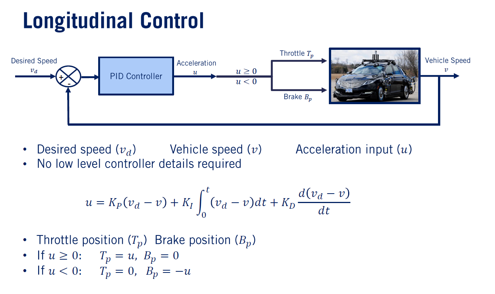
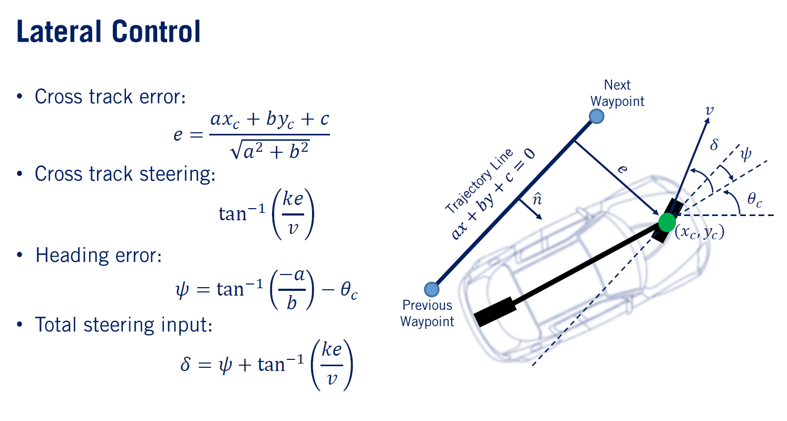
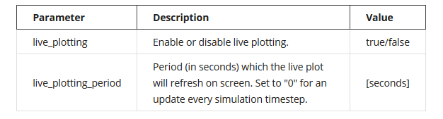
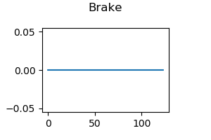
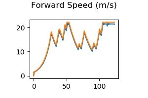
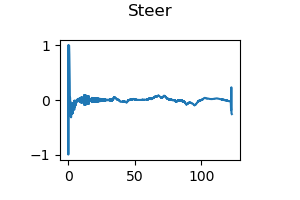
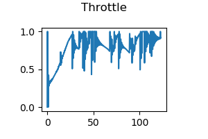
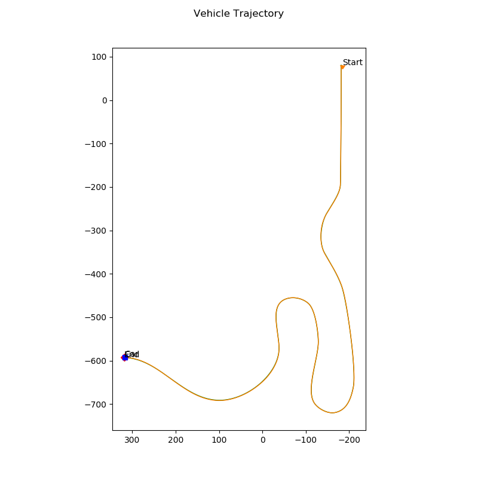

# Self-Driving-Vehicle-Controller
Self Driving Vehicle Longitudinal and lateral Controller

## 1 - Overview 
In this project, I will write and implement a controller for the CARLA simulator. The goal is to control the vehicle to follow a race track by navigating through preset waypoints. The vehicle needs to reach these waypoints at certain desired speeds, so both longitudinal and lateral control will be required and implemented.


^^^^
Interfacing functions with CARLA
^^^^

**Note:** All units are in SI (meters, seconds, radians), and CARLA works in the left-handed coordinate system (due to the Unreal Engine adopting the left-handed coordinate system). This generally shouldn't be an issue for this project since the controller operates in the x, y and yaw space. 

## 2 - Longitudinal control (throttle and brake)



## 3 - Lateral control (Steering)



## 4 - How to run the project 

To run this project, the CARLA simulator along with this source code need to be installed. Please follow these instructions:

1) Follow the CARLA Installation guide to install the CARLA simulator here.
2) Clone this repo and place it's folder under "PythonClient" inside the "CarlaSimulator" (root) folder. This will create a subfolder "Self-Driving-Vehicle-Controller" under "PythonClient" which contains the project files.
3) In one terminal, start the CARLA simulator at a 30hz fixed time-step by running this command:
```
    CarlaUE4.exe /Game/Maps/RaceTrack -windowed -carla-server -benchmark -fps=30
```
4) In another terminal, change the directory to go into the "Self-Driving-Vehicle-Controller" folder, under the "PythonClient" folder. Run your controller, execute the following command while CARLA is open:

```
    python module_7.py
```
The simulator will begin to run if the module_7 client connects to the server properly. It will open two new feedback windows (unless live_plotting is disabled - see the editing of options.cfg below for more details), one of which shows the trajectory and the other which shows the controls feedback.

The trajectory feedback will contain the car, start and end positions, entire path/path traveled and a small shaded region which denotes the subset of interpolated points to be sent into the controller for control updates. Linear interpolation is used between waypoints to provide a finer resolution path/speed requests for the controller. The X and Y axes are in meters.

The controls feedback shows the throttle, steering and brake outputs, as well as the speed response for the simulation (desired speed and current speed in the single plot). This is a general feedback for viewing what the client is sending to the CARLA server in terms of control commands. The desired speed is set to the closest interpolated speed point to the current position of the car. The speeds are in meters per second and the throttle (0 to 1), brake (0 to 1) and steering (-1 to 1, or left to right turn) are unitless. Note that the steering command output inside controller2d.py is automatically converted from radians (-1.22 to 1.22 rad) to a percentage (-1 to 1) before the command is sent to the CARLA server. The X axis for all four plots in the controls feedback is the in-game time, in seconds.

If the simulation runs slowly, you can try increasing the period at which the live plotter refreshes the plots, or disabling the live plotting altogether. Disabling the live plotting does not affect the plot outputs at the end of the simulation.

To do this, edit the options.cfg file found in the "Self-Driving-Vehicle-Controller" folder for the relevant parameters. The following table below explains each option:



The client will close once you reach the final waypoint, or after around 200 to 250 in-game seconds have passed. After the simulation completes, a text file containing the trajectory generated by your controller is saved. This file is called "trajectory.txt" and it is located inside the "controller_output" folder under the "Course1FinalProject" folder. The plots for speed, throttle, brake, steering and the executed 2D trajectory are also saved into this folder.

## 5 - Project Output 

### Brake Output



### Forward Speed



### Steer Output



### Throttle Output 



### Trajectory 



### Video of the CARLA Simulation

You can check the full video on youtube [here](https://www.youtube.com/watch?v=gDv56-uDu3I).

